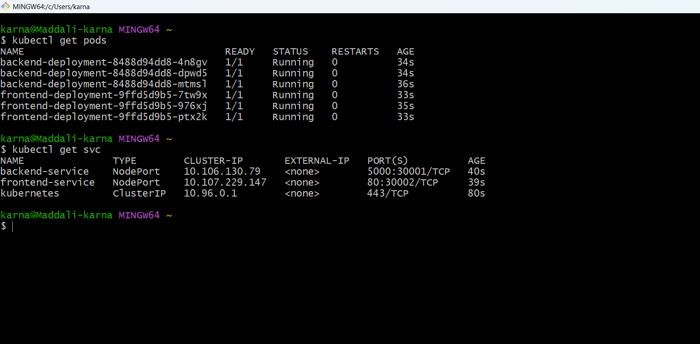
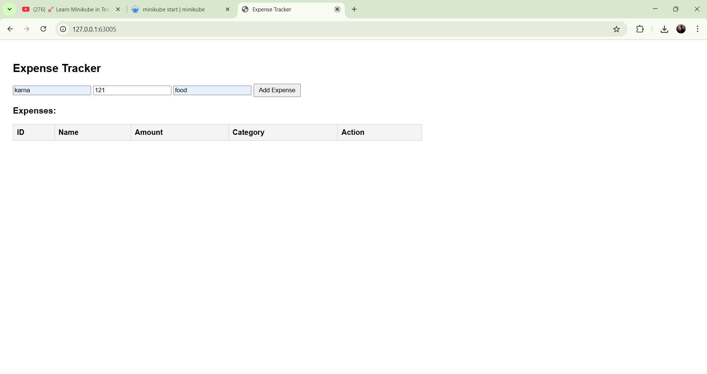
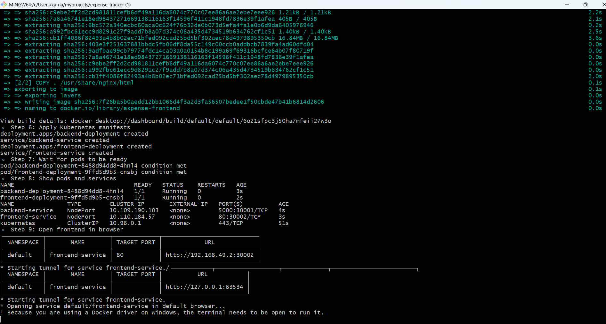

# 🚀 Task 5: Build a Kubernetes Cluster Locally with Minikube  

## 📌 Objective  
The goal of this task is to **deploy and manage applications in Kubernetes locally** using **Minikube**, **kubectl**, and **Docker**.  

By completing this task, you will learn how to:  
- Deploy applications using **Deployments**  
- Expose applications using **Services**  
- Scale and manage Kubernetes workloads  
- Access applications locally  

---

## 🛠️ Tools Used  
- **Minikube** – Run a local Kubernetes cluster  
- **kubectl** – Manage Kubernetes resources  
- **Docker** – Build container images

## Screenshots
 

## Screenshots
 

 ## Screenshots
 

  ## Screenshots
 


---

## 📂 Project Structure  
```bash
expense-tracker/
├── backend/                 # Backend application
│   ├── app.py
│   ├── requirements.txt
│   └── Dockerfile
├── frontend/                # Frontend application
│   ├── index.html
│   └── Dockerfile
├── k8s/                     # Kubernetes manifests
│   ├── backend-deployment.yaml
│   ├── backend-service.yaml
│   ├── frontend-deployment.yaml
│   └── frontend-service.yaml
└── README.md                # Documentation

⚡ Step-by-Step Execution
Step 1: Start Minikube
minikube start
minikube status

Step 2: Connect Docker CLI to Minikube

Linux/Mac (bash):

eval $(minikube docker-env)


Windows PowerShell:

Invoke-Expression (& minikube docker-env | Out-String)

Step 3: Build Docker Images
docker build -t expense-backend ./backend
docker build -t expense-frontend ./frontend


Backend → Python + Flask

Frontend → HTML/JS served via Nginx

Step 4: Apply Kubernetes Manifests
kubectl apply -f ./k8s/


This creates:

Backend Deployment → backend-deployment.yaml

Backend Service → backend-service.yaml (NodePort: 5000)

Frontend Deployment → frontend-deployment.yaml

Frontend Service → frontend-service.yaml (NodePort: 80)

Step 5: Verify Pods & Services
kubectl get pods


Example output:

NAME                                  READY   STATUS    RESTARTS   AGE
backend-deployment-xxxxxxx            1/1     Running   0          2m
frontend-deployment-xxxxxxx           1/1     Running   0          2m


Check services:

kubectl get svc


Example output:

NAME               TYPE       CLUSTER-IP      EXTERNAL-IP   PORT(S)        AGE
backend-service    NodePort   10.97.102.217   <none>        5000:30001/TCP
frontend-service   NodePort   10.102.79.124   <none>        80:30002/TCP

Step 6: Access Applications Locally

Use port-forwarding:

kubectl port-forward service/frontend-service 8080:80
kubectl port-forward service/backend-service 5000:5000


Frontend → http://localhost:8080

Backend → http://localhost:5000

Step 7: Scale Deployments
kubectl scale deployment/frontend-deployment --replicas=3
kubectl scale deployment/backend-deployment --replicas=3
kubectl get pods

Step 8: Debugging Pods & Logs

View logs:

kubectl logs <pod-name>


Describe pod details:

kubectl describe pod <pod-name>

📖 Key Kubernetes Concepts Learned

Pods → Smallest deployable unit in Kubernetes

Deployments → Manage pods, scaling, and rolling updates

Services → Expose applications (ClusterIP, NodePort, LoadBalancer)

Scaling → Increase/decrease replicas for load management

Port-forwarding → Access services locally

Rolling Updates → Update apps without downtime


